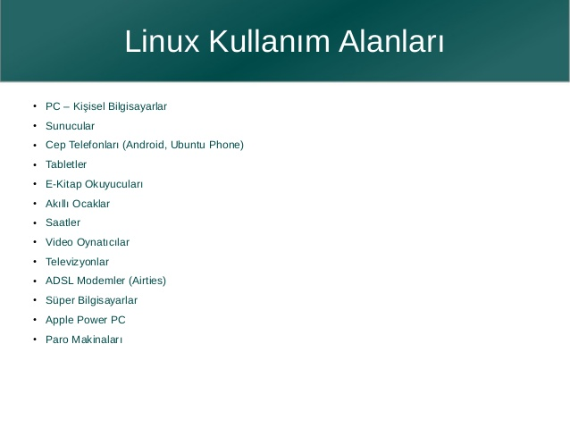
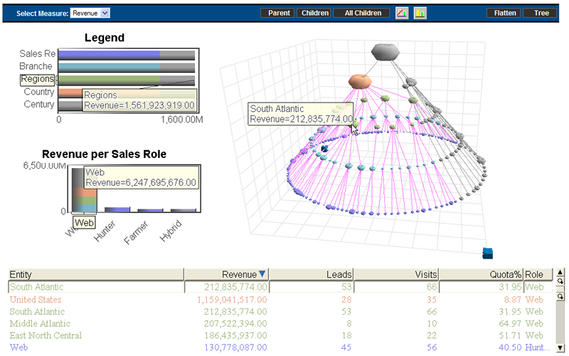
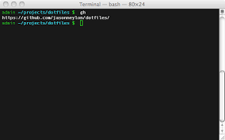

# Linux İşletim Sistemi

## GNU/Linux Hakkında

![Veri Analizi] (creativity_technology.png) 


Açık kaynak kodlu ve özgür bir işletim sistemi çekirdeği olan Linux, Unix işletim sistemi kaynak alınarak oluşturulmuştur. İşletim sistemi çekirdeği, yazılım ve araçların tümünü ifade etmek için GNU/Linux terimi kullanılır. Linux sayesinde GNU (GNU is Not Unix) Projesi'nin en büyük eksiği olan çekirdeği tamamlanmıştır.

Linux, 1991 yılında Finlandiyalı bir üniversite öğrencisi olan Linus Torvalds tarafından, daha eski işletim sistemlerinden birisi olan UNIX'ten esinlenerek geliştirilmeye başlanmıştır. Linus hâlen çekirdek geliştirme ekibindedir.

Linus Torvalds, Unix benzeri MINIX işletim sisteminden daha iyi bir işletim sistemi yaratmak düşüncesiyle 1991 Nisan ayında işletim sistemi çekirdeğini oluşturmaya başladı. 25 Ağustos 1991'de, comp.os.minix adresli MINIX haber grubuna gönderdiği yazıda yeni bir işletim sistemi geliştirmekte olduğunu ve ilgilenen herkesin yardımını beklediğini yazdı. Daha sonra 17 Eylül 1991'de Linux'un ilk sürümü olan 0.01'i İnternet'te yayınladı. Kısa bir süre sonra, 5 Ekim 1991'de temel özellikleriyle beraber ilk resmi Linux sürümü olan 0.02'yi yayınladı.[kaynak] (https://tr.wikipedia.org/wiki/Linux)

Unix işletim sistemi ile uyumlu olarak geliştirilmeye başlanması, GNU/Linux'un taşınabilir olmasını ve kullanıcıların kolayca uyum sağlayabilmesini kolaylaştırmıştır. Bunun yanında, GNU/Linux kodları sil baştan yazılmış ve temel metin biçimlendirici olarak TeX kullanılmıştır. Yazılımın geliştirilmesi, internet üzerinden iletişim kurabilen kullanıcıların (programcıların) işbirliği ile sağlanmıştır ve günümüzde de devam etmektedir. GNU/Linux'un bağlı olduğu GNU projesi, özgür yazılımlar oldukları için kullanılmaları sağlanan ve kullanıcıların kendi amaçları doğrultusunda geliştirilen işletim sistemlerini ve programları içerir.

Açık kaynaklı yazılımlarda, yazılımın güncellenmesi tüm kullanıcılar tarafından yapılabilir. Yazılımda değişiklik, istenilen amaç doğrultusunda uyarlama yapmak mümkündür. GNU/Linux işletim sistemi de açık kaynaklı olduğu için dünya çapında birçok geliştiricisi vardır. GNU/Linux için geçerli olarak; programcılar istedikleri şekilde yenilikler ve düzenlemeler yapar ve belli bir süre boyunca sistem kapatılarak sabit bir kurum tarafından bu düzenlemeler ve yenilikler derlenerek yeni sürümün duyurusu yapılır.

Özgür yazılımların kullanıcılar tarafından çalıştırılmaları, çoğaltılmaları, ücretli-ücretsiz dağıtımları, istenildiği şekilde kullanılarak değiştirilip, geliştirilmeleri ve kaynak alınarak yeni işletim sistemlerinin oluşturulması mümkündür.

Açık kaynak kodlu işletim sistemleri lisanlı veya lisanssız olabildiği gibi özgür yazılımların hepsi lisanssızdır. Buna göre, her özgür yazılım açık kaynaklı iken her açık kaynaklı yazılım özgür değildir.

GNU/Linux'un kullanım alanlarından bazıları; Android işletim sistemine sahip mobil telefonlar, tabletler, televizyonlar, oyun konsolları, eğitim simülatörleri, uçaklar ve otomobillerdir.



Yazılımın sahipsiz olması farklı kullanıcılar tarafından geliştirilmesini mümkün kılar.Bu sayede kısa sürede fazla özellik kazandırılabilir. Yazılımda oluşacak hataların düzeltilmesi de daha hızlı gerçekleşir. En önemli özelliklerden biri ise, insanlar arasında yardımlaşmayı sağlamasıdır. Böylece farklı toplumlar arasındaki bağları kuvvetlendirir. Bu sayede kişisel olarak değil evrensel olarak kazanç sağlanır. Maddi kayıp olmadığı gibi manevi kazanç sağlanır ve bu, günümüzde en çok ihtiyaç duyulan şeylerden biridir.

GitHub takım üyeleri, Yahoo! merkez ofisinde 24 Şubat 2009 tarihinde yaptıkları konuşmada; henüz bir yıl olmadan 46.000 açık kaynaklı depoya ulaştıklarını, bu depolardan 17.000 tanesinin Ocak 2009 da yaratıldığını belirtmişlerdir. Bununla birlikte 6.200 deponun en az bir kez çatallandığını (fork), 4.600 adedinin tekrar birleştiğini (merge) açıklamışlardır. 5 Temmuz 2009 tarihli web günlüğü makalesinde GitHub'ın 100.000 kullanıcıya ulaştığı duyurulmuştur.Temmuz 2015 itibarı ile Github, 10.3 milyon kayıtlı kullanıcıya ve 25 milyon kaynak deposu adedine ulaşmıştır
[kaynak](https://tr.wikipedia.org/wiki/GitHub)

## GNU/Linux Kullanımında Gerekli Bilgiler

### Dosya Sistem Yapısı

Klasörler dosyaları içeren yapılardır. Dosyalar; sistem, kullanıcı ve çalışabilir dosyalar olmak üzere üçe ayrılır. Sistem dosyaları, işletim sisteminin kullandığı metin tipinde yazılmış dosyalardır. Kullanıcı dosyaları, işletim sistemi kullanıcılarının sayısal ve alfabetik veriler içeren metin tipinde dosyalarıdır. Çalışabilir dosyalar, özel yazılım ürünleri olan ve belli amaçlar doğrultusunda oluşturulmuş programlardır.


Her bir klasörün içerikleri özet olarak şöyle sıralanabilir:
bin

 : İşletim sisteminin kullanılabilmesi için gerekli zorunlu komut dosyalarını içeren klasördür. Sistem yapılandırması, onarım ve veri kurtarma sırasında burada bulunan komutlar aktif hale geçer.

dev

 : Donanımların dosyalar halinde görünmesini sağlar.

etc

 : Çalıştırılabilir olmayan sistem yapılandırma dosyalarını ve kullanıcı ile grup bilgilerini içeren dosyaların bulunduğu klasördür.

home

 : İçinde bulundurduğu alt klasörlerde kullanıcının resim, müzik, video gibi kişisel bilgilerini içeren klasördür. Kullanıcı kendi bilgileri dışında şifresini bildiği diğer kullanıcıların bilgilerine de erişebilir.

sbin

 : Sistem yöneticisinin çalıştırılabilir dosyalarını içeren klasördür.

usr

 : Paket yöneticilerin yüklediği veya işletim sistemi içerisinde bulunan uygulamaları içeren klasördür.

tmp

 : Uygulamalar için gerekli geçici dosyaları içeren klasördür.

var

 : Değişken dosyaları içeren klasördür.
 


Daha detaylı klasör yapısı hakkında [akış diyagramı](http://blog.danyll.com/linux-directory-map/) resmine bakılabilir. Ayrıca, terminalde `man hier` komutu ile hiyerarşik dosya yapısı hakkında bilgi edinilebilir.

### Terminalin Genel Görünümü

Terminalde çalışılırken genel görünüm aşağıdaki gibidir. Yeşil renkli kısımda kullanıcı adı ve çalışılan makine adı verilmektedir. Sarı renkli kısım ise şu anda çalışılan klasörün adını göstermektedir. Dolar işaretinden ($) sonraki kısımda ise istenilen komut girilmektedir. Kitapta verilecek olan örneklerde $ işaretinden sonraki kısım gösterilecektir. Bu durumda $ işareti ile başlayan satırlar, komutların yazıldığı satır; $ işareti olmayan satırlar ise terminalde görüntülenen kısımlardır.



{#terminal-genel-gorunum}


### Komut Öldürmek

Çalışılan komutun işlemi uzun sürdüğünde veya o işlemi yapmaktan vazgeçildiği zaman Kontrol ve c tuşlarına aynı anda basarak (ctrl+c) komutun işlevi durdurulabilir.

### Hata ve Uyarı Mesajları

Bu kitapta öğreneceğiniz komutlar ile çalışırken karşınıza çıkabilecek muhtemel uyarı ve hata mesajları şöyledir:

A is not sorted

 : A isimli dosya sıralanmamış. Bu uyarı mesajı [comm](#comm-komutu) veya [join](#join-komutu) komutları kullanılırken görülebilir. Bunun nedeni bu komutların dosyaları sıralı şekilde sunulmasını istemesidir. Sıralanmamış olması halinde uyarı verir.

Command not found

 : Komut bulunamadı. Bu hata mesajı komutun yanlış yazıldığını gösterir.

No such file or directory

 : Belirtilen dosya veya klasör bulunamamıştır. Komutla beraber kullanılması istenilen dosyanın/klasörün adı yanlış yazıldığında veya böyle bir dosya/klasör olmadığı durumda ortaya çıkan hata mesajıdır. Bu hata mesajının bir diğer anlamı da komut için belirtilen ifade, motif ya da karakterin anlaşılamamasından kaynaklı olabilir. Terminalde tanımlı karakterler komut satırına yazıldığında, öncelikle terminalde ardından komutta çalıştırılmak istenir. Böyle karışıklıklara engel olmak için kullanılan karakter çift tırnak (") içinde yazılmalıdır.

Permission denied

 : Dosya/klasöre erişim yetkisi yoktur.

Unexpected character

 : Tek tırnak veya çift tırnak kapatılmadığı zaman oluşan hatadır.

No space left on device

 : Hard diskte yer kalmamıştır.

> Bazı komutlar için kullanılan karakterler önce terminal tarafından yorumlanıp sonra komut tarafından yorumlanır. Terminalde anlamı olan karakterlerin sadece komut tarafından yorumlanması isteniyorsa tırnak işareti (' ') içinde kullanılmalıdır. Tek tırnak (' ') işareti ile çalışabilen komutlar olduğu gibi, bazı komutlar ise çift tırnak ("") ile çalışabilir. Komutun kullanımının doğruluğundan emin olunduğu zaman hatanın bunlardan kaynaklanabileceği düşünülmelidir.

### Sayı aralıkları {#sayi-araliklari}

Çalışması için sayı veya harf gerekli komutlar da sayılar veya harfler sıralanırken aralarına virgül (,), belli bir aralık yazmak istenirse kısa çizgi (-) konur. Örneğin; 1,2,4,5,8 ifadesi bu beş sayıyı (1,2,4,5,8) belirtirken; 1-5 ifadesi ise bir ve beş dahil aradaki tüm sayıları (1,2,3,4,5) belirtir. Başka bir örnek daha vermek gerekirse; 1,2,9-15,22,24-26 ifadesi 1, 2, 9, 10, 11, 12, 13, 14, 15, 22, 24, 25 ve 26 sayısını belirtir.

### İnput - Output Açıklaması

İnput, işleme alınacak dosyalar ve komutlardır; kısaca girdi olarak tanımlanır. Output, işlemin ve komutun sonuçlarıdır; kısaca çıktı olarak tanımlanır.

Herhangi bir işlemden sonra alınacak outputun ekranda görüntülenmesi isteniyorsa ekstra işlem yapılmaz. Elde edilen output ayrı bir dosya olarak kaydedilmek isteniyorsa büyüktür (>) işareti, başka bir işlemin çıktısı olarak kullanılmak isteniyorsa çubuk (|) işareti kullanılır.

Leontief tarafından geliştirilen girdi-çıktı modeli, pek çok ülkenin iktisadi planlama amacı ile kullandığı ve 1950’li yıllarda son derece popüler olan bir yöntem. [kaynak](http://iibf.ogu.edu.tr/maslan/DERSLER/MATEMAT%C4%B0KSEL%20%C4%B0KT%C4%B0SAT/DERS%20NOTLARI/lecture-5%20-c%20input-output%20modeli.pdf)

> Türkçe klavyelerde çubuk işareti Alt Gr ve < tuşlarına aynı anda basarak elde edilebilir.


Aşağıdaki örnekte, **`seq`** komutu ile 1'den 5'e kadar sayı üretilmektedir. İlk komutta, çıktı ekranda görüntülenmiş, ikinci komutta sayılar `sayı` adlı dosyaya kaydedilmiştir. Üçüncü komutta **`seq`** komutunun çıktısı **`shuf`** komutuna gönderilmiş ve çıktı (sırası karıştırılmış sayılar) ekranda görüntülenmiştir. Son komutta da iki komutun birleşmiş çıktısı `sayı-karışık` adlı dosyaya kaydedilmiştir.

{line-numbers=off}
<<[Şekil 1.4 Örneklerle input output anlatımı](code/output-ornek.txt)

### Geçmiş Komutlarda Arama

Daha önceden yazılmış ve geçmişe kayıtlı olan komut satırlarına dönmek için yukarı ok tuşuna basılır. Yukarı ok tuşuna bir kez basıldığında bir önce yazılmış komut satırına ulaşılır ve ne kadar önceki komut satırına ulaşılmak isteniyorsa o  kadar çok yukarı ok tuşu tıklanmalıdır.

Daha gelişmiş arama yapmak için ctrl+r tuşlarına basılır ve aranacak harfler yazıldıkça harfleri içeren en son komut satırı ekrana gelir. Daha eski komut satırı sonuçlarına ulaşmak için ctrl+r'ya tekrar tekrar basılmalıdır.

### Jokerler (Wildcards) {#jokerler}

Yıldız (\*)
 : Geçerli klasördeki tüm dosyaları veya başına belli bir kelime yazılarak o kelime ile başlayan tüm dosyaları ifade eder. Örneğin klasörde sayı1, sayı2, sayı36, sayılar diye dört dosya varsa bunlar teker teker yazmak yerine sayı* şeklinde de ifade edilebilir.

Soru İşareti (?)
 : Geçerli klasördeki sadece sondaki tek bir karakteri farklı olan dosyaların tümünü ifade eder. Örneğin yine sayı1, sayı2, sayı36, sayılar diye dört dosya içeren aynı klasör için sayı? yazılırsa sayı1 ve sayı2 dosyaları belirtilmiş olur.

> Daha detaylı jokerler için [Just Enough Linux](https://leanpub.com/jelinux/read) adlı kitabın Wildcards kısmına bakılmalıdır.

### Locale

GNU/Linux terminali ülkelere göre farklılık gösterir. Bu farklılıklardan en belirgini Türkçe yazım kurallarında sayısal veriler yazılırken binler basamağını belirtmek için nokta ve sayının ondalık kısmını belirtmek için virgül ayıracı kullanılırken Amerikan İngilizcesi yazım kurallarına göre bu terstir. Örneğin; bin iki yüz elli lira seksen kuruş sayısal olarak yazılırken TR standartlarına göre 1.250,80 TL şeklinde yazılırken, US standartlarına göre 1,250.80 şeklinde ifade edilir. **`sort`** komutu ile sayısal sıralama yapılırken locale önemlidir. Yanlış locale kullanıldığında yanlış sıralama gerçekleşir.

### Tar Arşivi Açımı

Bu kitapla beraber indirilecek dosya sıkıştırılmış arşiv dosyasıdır ve kitaptaki örneklerin ve soruların denenmesi için gerekli dosyalar arşiv halinde mevcuttur. Herhangi bir sıkıştırılmış tar arşiv dosyasını açmak için aşağıdaki komut kullanılmalıdır.

%%%% TODO indirme linki, yukarıdaki cümleye eklenmeli

>`$ tar xzvf dosyaadı.tar.gz`

`tar` komutundan sonra kullanılan harfler belirli opsiyonlar içindir.

x - sıkıştırılmış dosyayı açmak için kullanılan opsiyon (extract)

z - gz formatında sıkıştırılmış dosyalar için kullanılan opsiyon

v - yapılan işlemlerin ayrıntılı gösterilmesini isteyen opsiyon

f - arşiv dosyası ismi kullanılacağını gösteren opsiyon

Tar arşivi açıldığında, arşiv içinde bulunan tüm klasör ve alt klasörleri komutun çalıştırıldığı klasörde otomatik olarak açılır.

> Arşiv dosyasını açarken doğru klasörde olduğunuzdan emin olunuz. Eğer **`tar`** komutunu `Masaüstü` klasöründeyken çalıştırırsanız arşiv içerikleri `Masaüstü` klasörünün içine açılır.

### Örnek kullanımı:

>`kullanıcı@makine:~/yenidizin$ ls`
>`mavi turuncu yeşil pembe mor siyah`

Öncelikle ls komutu ile şuan bulunduğumuz diziyi görüntüleyelim.

>`kullanıcı@makine:~/yenidizin$ tar -cvf etekler.tar mavi turuncu yeşil pembe mor siyah`

Yukarıdaki komut ile mavi turuncu yeşil pembe mor siyah dosyaları etekler.tar dosyasında arşivlenir.

>`kullanıcı@makine:~/yenidizin$ ls`
>`mavi turuncu yeşil pembe mor siyah etekler.tar`

Artık yenidizin, etekler.tar arşiv dosyasına da sahiptir.

>`kullanıcı@makine:~/yenidizin$ tar xvf etekler.tar`

tar xvf etekler.tar komutu vererek arşivdeki dosyaları tekrar dışarı çıkarabiliriz.

>`kullanıcı@makine:~/yenidizin$ gzip etekler.tar`

gzip etekler.tar komutu tar dosyalarını sıkıştırmaya yarar.Bu komutla etekler.tar dosyanızın adı artık örnek.tar.gz olur

>`kullanıcı@makine:~/yenidizin$ gzip -d etekler.tar`

Bu komutla sıkıştırılan arşiv geri eski haline gelir.


### Dosya ve Klasör İzinleri {#dosya-klasor-izin}
 
Terminalde dosya ve klasörleri detaylı şekilde listelediğimiz zaman aşağıdaki şekilde bilgiler sunulmaktadır:

>`-rwxr-xr-x 1 ogrenci users 20974 Mar 8 2014 ascii.pdf`

* İlk sütun dosya veya klasöre erişim izinlerini gösterir. İlk karakter ilgili ögenin dosya mı klasör mü olduğunu belirtir. Öge; d ise klasör, - ise dosyadır. Diğer karakterler izinleri belirtir. Bütün izinleri açılmış dosya -rwxrwxrwx şeklinde, tüm izinleri kapalı dosya ise ---------- şeklinde görünür. r: Okuma iznini, w: Yazma iznini, x: Yürütme iznini belirtir.

	Buradaki ikinci, üçüncü, dördüncü ögeler sahibinin izinlerini, beşinci, altıncı, yedinci ögeler grubun izinlerini ve sekizinci, dokuzuncu, onuncu ögeler de her kulanıcının izinleri ifade eder.

* İkinci sütun hard link sayısını gösterir (gözardı edilebilir).
* Üçüncü sütun ilgili dosya veya klasörün kullanıcı sahibini gösterir.
* Dördüncü sütun ilgili dosya veya klasörün grup sahibini gösterir.
* Beşinci sütun ilgili dosya veya klasörün byte olarak boyutunu gösterir. Eğer öge klasör ise, ifade edilen boyut klasörün içinin boyutu değil klasörün kendi boyutudur. Klasör boş bile olsa klasörle ilgili bilgilerin tutulduğu alan 4 Kb olarak görülür.
* Altıncı, yedinci ve sekizinci sütunlar ilgili dosya veya klasörün son değiştirilme zamanını verir. Aynı yıl içinde değişiklik olduysa yıl, eski yıllarda değişiklik olduysa saat gösterilmez.
* Son sütun ilgili dosya veya klasörün ismini gösterir.


[Kaynak](http://www.ics.uci.edu/computing/bin/img/perms1.png)

### Boşluk karakteri {#bosluk-karakteri}

Terminalde komutlar çalıştırılmak istendiğinde boşluk karakteriyle ilgili sorunlar yaşayabilirsiniz. Bu yüzden, boşluk karakteri hakkında dikkat edilmesi gereken önemli bir bilgiyi anlamak gerekmektedir.

Terminal komutlarının çoğu birden fazla argüman kabul etmektedir. Örnek olarak dosya silmek için kullanılan `rm` komutuyla birden fazla dosya silinmek isteniyorsa, dosya isimleri argüman olarak kullanılabilir, `rm dosya1 dosya2` komutu dosya1 ve dosya2 adlı dosyaların silinmesi manasına gelmektedir. Fakat bu durumda boşluk karakteri içeren dosya isimlerinde sorun yaşanacaktır. Örnek olarak, `Eski dosya.txt` isimli bir dosyayı silmek istediğimizde `rm Eski dosya.txt` komutu aşağıdaki gibi bir hata mesajına sebep olacaktır:

```
$ rm Eski dosya.txt
rm: cannot remove 'Eski': No such file or directory
rm: cannot remove 'dosya.txt': No such file or directory
```


`rm Eski\ dosya.txt`

Bu işleme kaçış (ing. escape) denilmektedir.

%%%% TODO Argümaları ayırmak için kullanılmadığığ, dosya isminin bir parçası olduğu

### Dosya türleri ve uzantıları {#dosya-turleri}

Maalesef, Windows işletim sisteminin kullanıcıların işini kolaylaştırmak için seçtiği yöntemler yüzünden dosya türü konusunda bazı yanlış anlamalar olmaktadır. Windows sisteminde bir dosya üzerine çift tıklandığında uygun yazılım ile o dosya açılmaktadır. Mesela, .doc veya docx uzantılı bir dosya Microsoft Word ile açılmaktadır. Bu yüzden "korelasyon" ile "sebep-sonuç ilişkisi" [karıştırılmaktadır](https://en.wikipedia.org/wiki/Correlation_does_not_imply_causation). Bir dosya, *uzantısı .doc veya .docx olduğu için Word ile açılıyor* şeklinde bir kabul ortaya çıkmaktadır. Bir dosya ancak uygun [Word binary format](https://en.wikipedia.org/wiki/Microsoft_Word#Binary_formats_.28Word_97.E2.80.932007.29) taşıyorsa Word tarafından açılabilir, uzantısı ne olursa olsun.

Bu durum, Linux terminalinde çalışırken daha kolay anlaşılacaktır. Terminalde çalışırken genellikle [*plain text*](https://en.wikipedia.org/wiki/Plain_text) formatında dosyalar ile çalışacağız (Windows kullanıcıları için .txt dosyası, yani *Not Defteri* programı ile açılabilen dosyalar). Komutlarımızın sonuçlarını *plain text* dosya şeklinde kaydederken istediğimiz uzantıyı seçebiliriz ve bu o dosyayı görüntülemeye engel olmaz. Bu yüzden, terminalde çalışırken "hangi uzantı ile kaydedelim?", "hangi program ile görüntüleyebiliriz?" veya "bu dosyayı açmak için gerekli software yüklü mü?" gibi sorular gereksiz olacaktır.

Yukarıda anlatılanlar, terminalde çalışırken uzantılar rastgele seçilebilir, manasına gelmemektedir. Dosya oluştururkenUygun uzantılar seçilmelidir ve bu hangi yazılım tarafından açılacağına uygun olarak değil, dosya türü hakkında fikir verecek şekilde olmalıdır. Örneğin, veri dosyaları .dat olarak adlandırılabilir, Perl kodu içeren dosyalar da .pl olarak adlandırılabilir. Geçici dosyalar da .tmp olarak adlandırılabilirler.

### Terminal egzersizleri için kaynaklar

Bilişim veya programlama türündeki bilgilerin en hızlı öğrenilmesi pratik yapma ve egzersiz ile mümkün olacaktır. Bu kitabı çok kısa sürede okuyup anlayabilirsiniz fakat bir terminal karşısına geçip pratik yapmazsanız maalesef bu kitapta anlatılanları kavramanız mümkün olmayacaktır. Aşağıda, terminal komutları hakkında pratik yapabilmeniz için kullanılabilecek web tabanlı kaynaklar listelenmiştir.

* [Terminus](http://web.mit.edu/mprat/Public/web/Terminus/Web/main.html) : Bu terminal oyunu yeni başlayanlara klasör ve dosyalarda gezinme kavramlarını öğretmek amacıyla yazılmıştır. Yeni başlayanlar için, terminale alışmak için oldukça yararlı olacaktır.
* [Tutorials Point - Unix Terminal Online](http://www.tutorialspoint.com/unix_terminal_online.php) : Bu websayfasında, online olarak tam fonksiyonlu bir terminal kullanabilirsiniz. Herhangi bir program kurmadan veya sabit bir makinede kullanıcı oluşturmadan bu websayfasında Linux terminalini kullanabilirsiniz. Sol taraftaki gizli panel sayesinde klasör ile etkileşebilirsiniz, çalışma klasörünüze dosya yükleyebilir veya bu klasörden dosya indirebilirsiniz. Dilerseniz bu kitapta kullanılan dosyaları çalıştığınız klasöre indirerek hiç zaman kaybetmeden kitaptaki komutları çalışmaya başlayabilirsiniz.
* [ExplainShell](http://explainshell.com/) : Bu websayfasında karmaşık ve uzun komutlar görsel olarak açıklanmaktadır.
* [OverTheWire Wargames](http://overthewire.org/wargames) : Bu site network güvenliği üzerine egzersizler yapılmak üzere kurulmuş olup *[Bandit](http://overthewire.org/wargames/bandit/)* başlıklı kısım terminale giriş için egzersizler içermektedir.
* [ShortcutFoo](https://www.shortcutfoo.com/) : Bu sitede hesap açtıktan sonra [Command Line](https://www.shortcutfoo.com/app/dojos/command-line) ve [Awk](https://www.shortcutfoo.com/app/dojos/awk) kısımlarında pratik yapılabilir ve diğer kullanıcılarla yarışma şeklinde öğrenme gerçekleşebilir.
* [Linux Survival](http://linuxsurvival.com/linux-tutorial-introduction/) : Oldukça interaktif olarak Linux'a dair temel konular işlenmiştir. Bazı komutların etkileri görsel bir şekilde anlatılmaya çalışılmıştır.
* [LearnShell.org](http://www.learnshell.org/) : İnteraktif şekilde Bash programlama anlatılmaktadır. Bu kitabın içeriğinin biraz dışındadır fakat interaktif olmasından dolayı yararlanılabilir bir kaynaktır. Bölüm sonlarındaki Quizler kendinizi değerlendirmek için kullanılabilir.
* [Unix Tutorial For Beginners](http://www.ee.surrey.ac.uk/Teaching/Unix/) : Başlangıç seviyesinde bilgiler veren bir site. Bu kitabın içeriği ile uyumlu kısım bu websayfasındaki ilk dört kısımdır (tutorial), diğer kısımlar bu kitapta işlenen konuların dışında kalmaktadır.
* [Ryans Tutorials - Linux](http://ryanstutorials.net/linuxtutorial/) : Bu websayfasında bu kitabın içeriğini anlamak için gerekli bilgiler mevcut olup bölüm sonlarındaki aktiviteler konuları kavramak için yararlı olacaktır. (Not: *6. Vi Text Editor* adlı kısmı gözardı ediniz)


%%%% TODO link for downloading course materials and instructions to use them at Tutorials Point website


